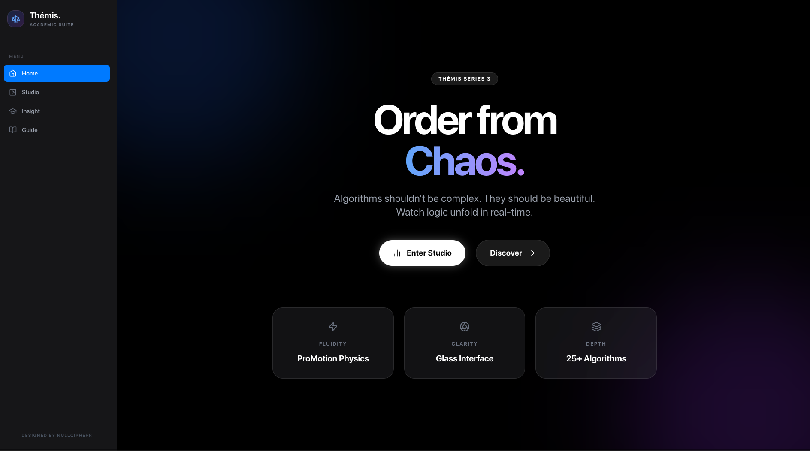
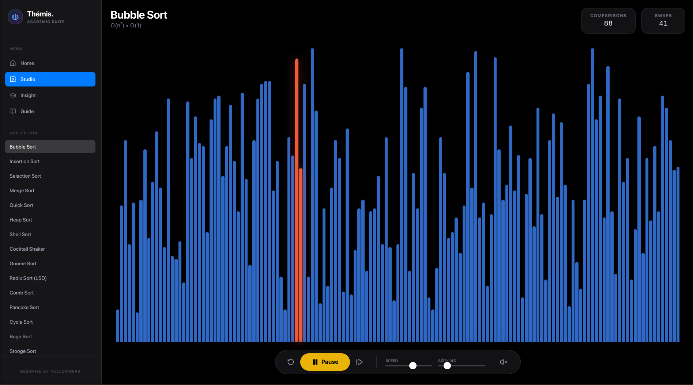

<div align="center">
  <h1>Themis Sort Visualizer</h1>
  <p><i>An interactive sorting-algorithm playground built with React, TypeScript, and Vite</i></p>

  <p>
    
    
    
    
  </p>
</div>

---

## Documentation

Project documentation is organized in `docs/`.

- [Documentation Index](docs/README.md)
- [Architecture](docs/en/ARCHITECTURE.md)
- [Algorithms](docs/en/ALGORITHMS.md)
- [Development](docs/en/DEVELOPMENT.md)
- [Deployment](docs/en/DEPLOYMENT.md)
- [Testing](docs/en/TESTING.md)
- [Roadmap](docs/en/ROADMAP.md)

---

## Preview




---

## Overview

**Themis Sort Visualizer** helps students and developers understand sorting algorithms through:

- real-time animated execution;
- step-by-step playback controls;
- algorithm learning pages with historical and complexity context;
- runtime counters for comparisons and swaps;
- mobile-friendly interface with responsive navigation.

All educational content is local. No external AI/API dependency is required at runtime.

---

## Features

- Visual simulation for **25 sorting algorithms**.
- Generator-based execution model (`Generator<SortStep>`) for frame-by-frame rendering.
- Interactive controls: `Play`, `Pause`, `Step`, `Reset`.
- Dynamic speed and array-size sliders.
- Optional Web Audio feedback for compare/swap/finish events.
- Algorithm lookup/search in the algorithm hub.
- Learning mode with contextual explanation and pseudo-code.

---

## Tech Stack

- React 19
- TypeScript 5
- Vite 6
- Framer Motion
- Lucide React
- CSS (custom styles in `src/styles/global.css`)

---

## Project Structure

```text
.
├── docs/
│   ├── assets/
│   │   ├── preview_001.png
│   │   └── preview_002.png
│   ├── en/
│   │   ├── ALGORITHMS.md
│   │   ├── ARCHITECTURE.md
│   │   ├── DEPLOYMENT.md
│   │   ├── DEVELOPMENT.md
│   │   ├── ROADMAP.md
│   │   └── TESTING.md
│   └── README.md
├── public/
│   └── _redirects
├── src/
│   ├── components/
│   ├── data/
│   ├── services/
│   ├── styles/
│   ├── types/
│   ├── App.tsx
│   └── main.tsx
├── index.html
├── package.json
├── tsconfig.json
├── vite.config.ts
└── wrangler.toml
```

---

## Getting Started

### Prerequisites

- Node.js 20+
- npm 10+

### Install and run

```bash
npm install
npm run dev
```

Default dev URL: `http://localhost:5173`

### Build for production

```bash
npm run build
npm run preview
```

Build artifacts are generated in `dist/`.

---

## Scripts

- `npm run dev`: start local development server.
- `npm run build`: create production bundle.
- `npm run preview`: preview production build locally.

---

## Current Known Limitation

`src/components/Visualizer.tsx` currently maps a subset of algorithms in `getGenerator`. If an algorithm is selected but not mapped, execution falls back to Bubble Sort.

Recommended follow-up: map all `AlgorithmType` values in `getGenerator` to their corresponding generator implementations.

---

## Contributing

Contributions are welcome. Please read:

- [Contributing Guide](CONTRIBUTING.md)
- [Code of Conduct](CODE_OF_CONDUCT.md)
- [Security Policy](SECURITY.md)

---

## License

This project is licensed under the [MIT License](LICENSE).
